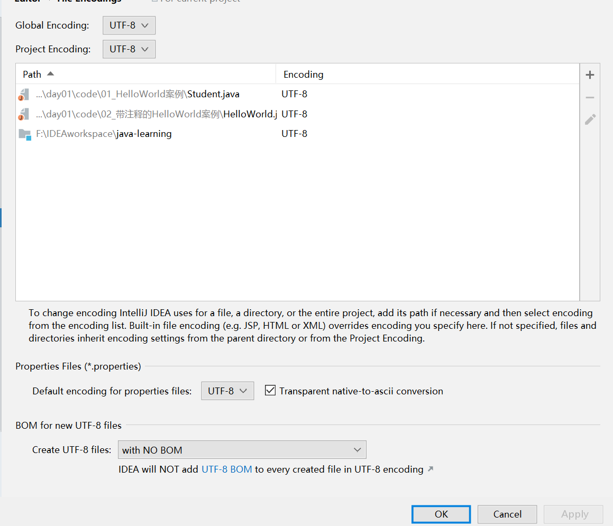
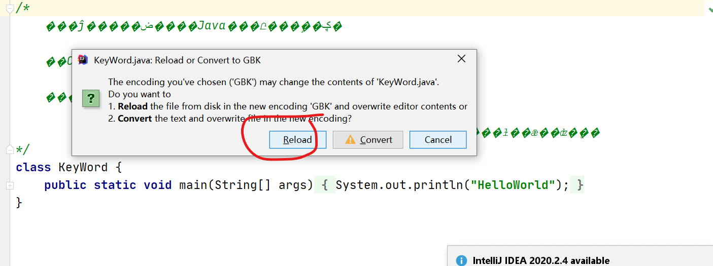
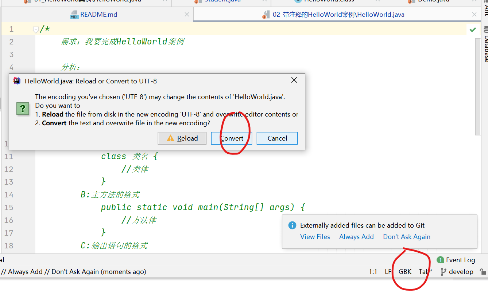

## Java
 * 27天成为Java大神
 
## Disclaimer
  版权归原作者所有，欢迎自由转载-非商用-非衍生-保持署名和链接。
## 问题
###1. 乱码，具体为.java文件注释乱码
解决方案：先将idea的编码设置为utf-8,ctrl+alt+s全部设置

然后右下角，点击reload将其转换为gbk,此时显示正常，但我们还是要utf-8

再次点击右下角，选择convert,完成

reload相当于是将ide的解码格式由utf-8转换为gbk,但文件本身的编码格式和内容并没有改变
convert则是将文件的编码格式由gbk转为utf-8，

如何将所有文件都转成lf
